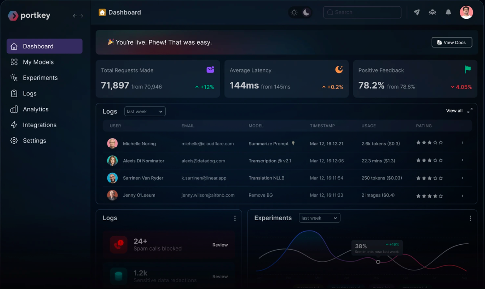
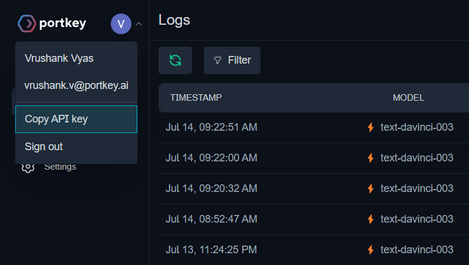

# Portkey Middleware

Portkey is a middleware solution that adds observability & production capabilities to your existing LLM workflows.

## Table of Contents
- [Portkey Features](#portkey-features)
- [Getting Your Portkey API Key](#first-lets-get-your-portkey-api-key)
- [Integrating with Langchain](#integrating-with-langchain)
- [Code Example](#enabling-all-portkey-features)

## Portkey Features
- Link multiple LangChain LLM requests to a single ID for easier tracking and analysis
- See all requests and their logs on a single dashboard
- Serve semantically similar queries from cache
- Add custom metadata to queries to enable advanced filters
- Do automatic retries if the LLM fails
- Pass weighted feedback to each request
- And more..




>**This guide covers how to integrate Portkey in your Langchain apps.**

### First, let's get your Portkey API key
1. Sign up for a [Portkey account here](https://app.portkey.ai/login).
2. On your [Portkey dashboard](https://app.portkey.ai/), click on your profile icon on the top left.
3. Click on "Copy API Key".



## Integrating with Langchain

Portkey does not require any package installation or config changes - it works out of the box with `langchain.llms.OpenAI`

### 2-Step To Add Portkey:

**1️⃣ Change OpenAI API base to Portkey proxy**
```ts
 configuration: {basePath: "https://api.portkey.ai/v1/proxy",}
```

**2️⃣ Pass Portkey related headers direct to your OpenAI call**
- For each request, you are required to pass 2 default headers:
  - `x-portkey-api-key` and ,
  - `x-portkey-mode`
- You can enable other Portkey features by adding their relevant headers as described below.

| Feature | Portkey Header | Value (Type) |
| -- | -- | -- |
| Portkey API Key | `x-portkey-api-key` | API Key (`string`) |
| Proxy Mode | `x-portkey-mode` | `proxy openai` |
| [Tracing Requests](https://docs.portkey.ai/key-features/request-tracing) | `x-portkey-trace-id` | Custom `string` |
| [Appending Custom Metadata](https://docs.portkey.ai/key-features/custom-metadata) | `x-portkey-metadata` | `_environment`, `_user`, `_organisation`, `_prompt`, Custom Key |
| [Automatic Retries](https://docs.portkey.ai/key-features/automatic-retries) | `x-portkey-retry-count` | `[1,2,3,4,5]` |
| [Enabling Cache](https://docs.portkey.ai/key-features/request-caching) | `x-portkey-cache` | `simple` OR `semantic` |
| Cache Force Refresh | `x-portkey-cache-refresh` | `True` |
| Set Cache Expiry | `Cache-Control` | `max-age:1000` (in seconds) |

### Enabling all Portkey features:

```ts
import { OpenAI } from "langchain/llms/openai";

const model = new OpenAI({
  modelName: "text-davinci-003", 
  temperature: 0.9,
  openAIApiKey: "<OPENAI_API_KEY>",
  configuration: {
    basePath: "https://api.portkey.ai/v1/proxy",
    baseOptions: {
      headers: {
        'x-portkey-api-key': '<PORTKEY_API_KEY>',
        'x-portkey-mode': 'proxy openai',
        'x-portkey-trace-id' : 'langchain_demo'
      }
    }
  }
});

async function main() {
  const res = await model.call("Describe the world as written by Herodotus.");
  console.log(res);
}
main();
```

## Conclusion

By following this guide, you can integrate Portkey into your LangChain applications to enhance their scalability and readiness for production. For more detailed information on each feature and how to use them, [please refer to the official Portkey documentation](https://docs.portkey.ai). If you have any questions or need further assistance, [feel free to reach out to the Portkey team on Twitter.](https://twitter.com/portkeyai).